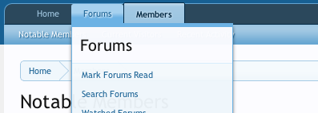

Navigation Entire Link Trigger Popup
===========================

This is a XenForo 1.2 Template Modification version of Jake Bunce's "[Make entire nav tab trigger popup (instead of just the down arrow)](http://xenforo.com/community/resources/make-entire-nav-tab-trigger-popup-instead-of-just-the-down-arrow.968/)."

It uses regular expressions in order to find the links, so multiple template edits are no longer necessary.

Instead of having to hover over the tiny down arrow in the top navigation:

You are now able to simple hover over the entire link.

Support
------------
This modification is unsupported as it may not work on all XenForo styles.

Requirements
------------
* [XenForo](http://xenforo.com/) 1.2.0